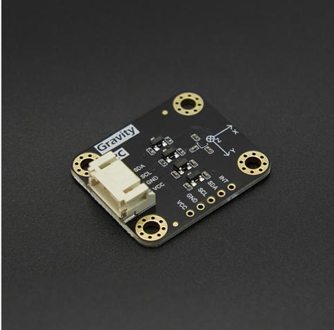

DFRobot_BMP350
===========================

* [English Version](./README.md)

BMM350 是一款低功耗、低噪声的 3 轴数字地磁传感器，完全符合罗盘应用的要求。 基于博世专有的 FlipCore 技术，BMM350 提供了高精度和动态的绝对空间方向和运动矢量。 体积小、重量轻，特别适用于支持无人机精准航向。 BMM350 还可与由 3 轴加速度计和 3 轴陀螺仪组成的惯性测量单元一起使用。



## 产品链接（[https://www.dfrobot.com.cn](https://www.dfrobot.com.cn)）

```yaml
SKU: SEN0619
```

## 目录

* [概述](#概述)
* [库安装](#库安装)
* [方法](#方法)
* [兼容性](#兼容性)
* [历史](#历史)
* [创作者](#创作者)

## 概述

您可以沿 XYZ 轴获取地磁数据

1. 本模块可以获得高阈值和低阈值地磁数据。 <br>
2. 可以测量三个（xyz）轴上的地磁。<br>
3. 本模块可选择I2C或I3C通讯方式。<br> 

## 库安装

使用此库前，请首先下载库文件，将其粘贴到\Arduino\libraries目录中，然后打开examples文件夹并在该文件夹中运行演示。

## 方法

```C++
  /**
   * @fn softReset
   * @brief 软件复位,软件复位后先恢复为挂起模式
   */
  void softReset(void);

  /**
   * @fn setOperationMode
   * @brief 设置传感器的执行模式
   * @param opMode mode
   * @n eBmm350SuspendMode       挂起模式:挂起模式是芯片上电后BMM350的默认电源模式，在挂起模式下电流消耗最小，因此该模式适用于不需要数据转换的时期（所有寄存器的读写都是可能的）
   * @n eBmm350NormalMode        常规模式: 获取地磁数据      
   * @n eBmm350ForcedMode        强制模式: 单次测量，测量完成后传感器恢复到暂停模式
   * @n eBmm350ForcedModeFast   只有使用FM_FAST时，ODR才能达到200Hz
   */
  void setOperationMode(uint8_t opMode);

  /**
   * @fn getOperationMode
   * @brief 获取传感器的执行模式
   * @return result 返回字符串为传感器的执行模式
   */
  String getOperationMode(void);

  /**
   * @fn setPresetMode
   * @brief 设置预置模式,使用户更简单的配置传感器来获取地磁数据（默认的采集速率为12.5Hz）
   * @param presetMode
   * @n BMM350_PRESETMODE_LOWPOWER       低功率模式,获取少量的数据 取均值
   * @n BMM350_PRESETMODE_REGULAR        普通模式,获取中量数据 取均值
   * @n BMM350_PRESETMODE_ENHANCED       增强模式,获取大量数据 取均值
   * @n BMM350_PRESETMODE_HIGHACCURACY   高精度模式,获取超大量数据 取均值
   */
  void setPresetMode(uint8_t presetMode, uint8_t rate = BMM350_DATA_RATE_12_5HZ);

  /**
   * @fn getRate
   * @brief 获取配置的数据速率 单位：HZ
   * @return rate
   */
  uint8_t getRate(void);

  /**
   * @fn selfTest
   * @brief 传感器自测,返回值表明自检结果
   * @param testMode:
   * @n     eBmm350SelfTestNormal               常规自检，检查x轴、y轴、z轴是否接通或短路
   * @return result 返回的字符串为自测的结果
   */
  String selfTest(eBmm350SelfTest_t testMode = eBmm350SelfTestNormal);

  /**
   * @fn setMeasurementXYZ
   * @brief 使能x y z 轴的测量,默认设置为使能,禁止后xyz轴的地磁数据不准确
   * @param en_x
   * @n   BMM350_X_EN        使能 x 轴的测量
   * @n   BMM350_X_DIS       禁止 x 轴的测量
   * @param en_y
   * @n   BMM350_Y_EN        使能 y 轴的测量
   * @n   BMM350_Y_DIS       禁止 y 轴的测量
   * @param en_z
   * @n   BMM350_Z_EN        使能 z 轴的测量
   * @n   BMM350_Z_DIS       禁止 z 轴的测量
   */
  void setMeasurementXYZ(enum eBmm350XAxisEnDis_t enX = BMM350_X_EN, enum eBmm350YAxisEnDis_t enY = BMM350_Y_EN, enum eBmm350ZAxisEnDis_t enZ = BMM350_Z_EN);

  /**
   * @fn getMeasurementStateXYZ
   * @brief 获取 x y z 轴的使能状态
   * @return result 返回字符串为使能的状态
   */
  String getMeasurementStateXYZ(void);

  /**
   * @fn getGeomagneticData
   * @brief 获取x y z 三轴的地磁数据
   * @return 地磁的数据的结构体,单位：微特斯拉（uT）
   */
  sBmm350MagData_t getGeomagneticData(void);

  /**
   * @fn getCompassDegree
   * @brief 获取罗盘方向
   * @return 罗盘方向 (0° - 360°)
   * @n      0° = North, 90° = East, 180° = South, 270° = West.
   */
  float getCompassDegree(void);

  /**
   * @fn setDataReadyPin
   * @brief 使能或者禁止数据准备中断引脚
   * @n 使能后有数据来临DRDY引脚跳变
   * @n 禁止后有数据来临DRDY不进行跳变
   * @n 高极性：高电平为活动电平,默认为低电平,触发中断时电平变为高
   * @n 低极性：低电平为活动电平,默认为高电平,触发中断时电平变为低
   * @param modes
   * @n     BMM350_ENABLE_INTERRUPT        使能DRDY
   * @n     BMM350_DISABLE_INTERRUPT       禁止DRDY
   * @param polarity
   * @n     BMM350_ACTIVE_HIGH      高极性
   * @n     BMM350_ACTIVE_LOW       低极性
   */
  void setDataReadyPin(uint8_t modes, uint8_t polarity=POLARITY_HIGH);

  /**
   * @fn getDataReadyState
   * @brief 获取数据准备的状态,用来判断数据是否准备好
   * @return status
   * @n true  数据准备好了
   * @n false 数据没有准备好
   */
  bool getDataReadyState(void);

  /**
   * @fn setThresholdInterrupt(uint8_t modes, int8_t threshold, uint8_t polarity)
   * @brief 设置阈值中断,当某个通道的地磁值高/低于阈值时触发中断
   * @n     高极性：高电平为活动电平,默认为低电平,触发中断时电平变为高
   * @n     低极性：低电平为活动电平,默认为高电平,触发中断时电平变为低
   * @param modes
   * @n     LOW_THRESHOLD_INTERRUPT       低阈值中断模式
   * @n     HIGH_THRESHOLD_INTERRUPT      高阈值中断模式
   * @param  threshold
   * @n     阈值,默认扩大16倍,例如：低阈值模式下传入阈值1,实际低于16的地磁数据都会触发中断
   * @param polarity
   * @n     POLARITY_HIGH      高极性
   * @n     POLARITY_LOW       低极性
   */
  void setThresholdInterrupt(uint8_t modes, int8_t threshold, enum eBmm350IntrPolarity_t polarity);

  /**
   * @fn getThresholdData
   * @brief 获取发生阈值中断的数据
   * @return 返回存放地磁数据的结构体,结构体存放三轴当数据和中断状态,
   * @n xyz轴的数据为 NO_DATA 时,未触发中断
   * @n mag_x、mag_y、mag_z 存放地磁数据
   * @n interrupt_x、interrupt_y、interrupt_z 存放轴中断状态
   */
  sBmm350ThresholdData_t getThresholdData(void);
```

## 兼容性

| MCU                | Work Well | Work Wrong | Untested | Remarks |
| ------------------ |:---------:|:----------:|:--------:| ------- |
| Arduino uno        | √         |            |          |         |
| FireBeetle esp32   | √         |            |          |         |
| FireBeetle esp8266 | √         |            |          |         |
| FireBeetle m0      | √         |            |          |         |
| Leonardo           | √         |            |          |         |
| Microbit           | √         |            |          |         |
| Arduino MEGA2560   | √         |            |          |         |

## History

- 2024/05/08 - Version 1.0.0 released.

## Credits

Written by [GDuang](yonglei.ren@dfrobot.com), 2024. (Welcome to our [website](https://www.dfrobot.com/))
